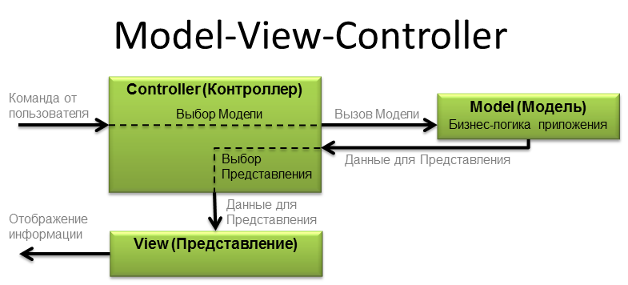

# Паттерны

Паттерн переводится с английского как "шаблон". То есть это некоторый образец, по которому мы что-то делаем. Так и в программировании. Есть некоторые выработанные лучшие практики (best practice) и подходы к решению часто встречаемых проблем.

Паттерны бывают разные, т.к. решают разные проблемы. Обычно выделяют следующие категории:

-Порождающие

Эти паттерны решают проблемы обеспечения гибкости создания объектов

-Структурные

Эти паттерны решают проблемы эффективного построения связей между объектами

-Поведенческие

Эти паттерны решают проблемы эффективного взаимодействия между объектами

# Порождающие паттерны

**"Строитель" (Builder)**

Паттерн проектирования Builder разработан для обеспечения гибкого решения различных задач создания объектов в объектно-ориентированном программировании.

Паттерн проектирования Builder позволяет отделить построение сложного объекта от его представления.

Паттерн Builder создает сложные объекты, используя простые объекты и поэтапный подход.

Паттерн предоставляет один из лучших способов создания сложных объектов.

Этот паттерн полезен для создания разных иммутабельных объектов с помощью одного и того же процесса построения объекта.

Паттерн Builder — это паттерн проектирования, который позволяет поэтапно создавать сложные объекты с помощью четко определенной последовательности действий. Строительство контролируется объектом-распорядителем (director), которому нужно знать только тип создаваемого объекта.

Product (продукт) - Класс, который определяет сложный объект, который мы пытаемся шаг за шагом сконструировать, используя простые объекты.

Builder (строитель) - абстрактный класс/интерфейс, который определяет все этапы, необходимые для производства сложного объекта-продукта. Как правило, здесь объявляются (абстрактно) все этапы (buildPart), а их реализация относится к классам конкретных строителей (ConcreteBuilder).

ConcreteBuilder (конкретный строитель) - класс-строитель, который предоставляет фактический код для создания объекта-продукта. У нас может быть несколько разных ConcreteBuilder-классов, каждый из которых реализует различную разновидность или способ создания объекта-продукта.

Director (распорядитель) - супервизионный класс, под конролем котрого строитель выполняет скоординированные этапы для создания объекта-продукта. Распорядитель обычно получает на вход строителя с этапами на выполнение в четком порядке для построения объекта-продукта.

**Паттерн проектирования Builder решает такие проблемы, как:**

Как класс (тот же самый процесс строительства) может создавать различные представления сложного объекта?

Как можно упростить класс, занимающийся созданием сложного объекта?

**Фабричный метод**

Другим известным подходом к созданию объекта — вынос создания в отдельный метод. Такой метод как бы становится фабрикой объектов. Поэтому и шаблон называется "Фабричный метод" (Factory Method).
Задача паттерна «Фабричный метод» — перемещение создания экземпляров в подклассы

**Паттерн Prototype - Прототип**

Шаблон Prototype позволяет создавать новые объекты на основе некоторого объекта-прототипа при этом совсем не обязательно знать как необходимый объект устроен.

Вот некоторые ситуации когда может помочь этот паттерн проектирования:

если создание объектов (через оператор new) занимает длительный промежуток времени или требовательно к памяти;
если создание объектов для клиента является нетривиальной задачей, например, когда объект составной;
избежать множества фабрик для создания конкретных экземпляров классов;
если клиент не знает специфики создания объекта.
В Java уже заложена функциональность для имплементации паттерна Прототип - интерфейс Cloneable.

Для этого достаточно объявить класс (который и будет прототипом), как реализующий Cloneable. Далее, вместо создания объектов нашего класса через оператор new, воспользуемся методом clone у ранее созданного объекта (прототипа).
Одним из способов реализации этого шаблона в Java является использование метода clone () 

Этот шаблон удобен, когда наш новый объект лишь немного отличается от существующего. 

**Паттерн "Одиночка" (Singleton)**
Цель его проста — обеспечить единственный экземпляр объекта на всё приложение. Данный паттерн интересен тем, что на нём часто показывают проблемы многопоточности

# Структурные паттерны (structural patterns)

"Заместитель" (Proxy)

Заместитель – это структурный паттерн проектирования, который позволяет подставлять вместо реальных объектов специальные объекты-заменители. Эти объекты перехватывают вызовы к оригинальному объекту, позволяя сделать что-то до или после передачи вызова оригиналу.

Интерфейс сервиса определяет общий интерфейс для сервиса и заместителя. Благодаря этому, объект заместителя можно использовать там, где ожидается объект сервиса.
Сервис содержит полезную бизнес-логику.
Заместитель хранит ссылку на объект сервиса. После того как заместитель заканчивает свою работу (например, инициализацию, логирование, защиту или другое), он передаёт вызовы вложенному сервису.
Заместитель может сам отвечать за создание и удаление объекта сервиса.
Клиент работает с объектами через интерфейс сервиса. Благодаря этому, его можно «одурачить», подменив объект сервиса объектом заместителя.
**Применимость**
Ленивая инициализация (виртуальный прокси). Когда у вас есть тяжёлый объект, грузящий данные из файловой системы или базы данных.

Вместо того, чтобы грузить данные сразу после старта программы, можно сэкономить ресурсы и создать объект тогда, когда он действительно понадобится.

Защита доступа (защищающий прокси). Когда в программе есть разные типы пользователей, и вам хочется защищать объект от неавторизованного доступа. Например, если ваши объекты – это важная часть операционной системы, а пользователи – сторонние программы (хорошие или вредоносные).

Прокси может проверять доступ при каждом вызове и передавать выполнение служебному объекту, если доступ разрешён.

Локальный запуск сервиса (удалённый прокси). Когда настоящий сервисный объект находится на удалённом сервере.

В этом случае заместитель транслирует запросы клиента в вызовы по сети в протоколе, понятном удалённому сервису.

Логирование запросов (логирующий прокси). Когда требуется хранить историю обращений к сервисному объекту.

Заместитель может сохранять историю обращения клиента к сервисному объекту.

Кеширование объектов («умная» ссылка). Когда нужно кешировать результаты запросов клиентов и управлять их жизненным циклом.

Заместитель может подсчитывать количество ссылок на сервисный объект, которые были отданы клиенту и остаются активными. Когда все ссылки освобождаются, можно будет освободить и сам сервисный объект (например, закрыть подключение к базе данных).

Кроме того, Заместитель может отслеживать, не менял ли клиент сервисный объект. Это позволит использовать объекты повторно и здóрово экономить ресурсы, особенно если речь идёт о больших прожорливых сервисах.

**"Декоратор" (Decorator)**
Декоратор ещё называют обёрткой или враппером (Wrapper). Прокси и декоратор очень похожи, но если посмотреть на пример — будет видна разница:

В отличии от прокси, декоратор оборачивается вокруг чего-то, что передали на вход.

**"Адаптер" (adapter)**
Он похож на декоратор — на вход декоратор принимает один объект и возвращает обёртку над этим объектом. Отличие в том, что цель у этого не изменение функционала, а адаптация одного интерфейса к другому.

**"Компоновщик" (Сomposite)**
Компоновщик позволяет клиентам обращаться к отдельным объектам и к группам объектов одинаково.
Паттерн определяет иерархию классов, которые одновременно могут состоять из примитивных и сложных объектов, упрощает архитектуру клиента, делает процесс добавления новых видов объекта более простым.

**"Мост" (Bridge)**
Описывает соединение или мост между двумя различными иерархиями классов.
Шаблон bridge является полезным там, где часто меняется не только сам класс, но и то, что он делает.

Существует множество типов фигур, каждая со своими свойствами и методами. Однако есть что-то, что объединяет все фигуры. Например, каждая фигура должна уметь рисовать себя, масштабироваться и т. п. В то же время рисование графики может отличаться в зависимости от типа ОС, или графической библиотеки. Фигуры должны иметь возможность рисовать себя в различных графических средах, но реализовывать в каждой фигуре все способы рисования или модифицировать фигуру каждый раз при изменении способа рисования непрактично. В этом случае помогает шаблон мост, позволяя создавать новые классы, которые будут реализовывать рисование в различных графических средах. При использовании такого подхода очень легко можно добавлять как новые фигуры, так и способы их рисования.
Мост служит именно для решения этой проблемы: объекты создаются парами из объекта класса иерархии А и иерархии B, наследование внутри иерархии А имеет смысл «разновидность» по Лисков, а для понятия «реализация абстракции» используется ссылка из объекта A в парный ему объект B.

**"Фасад" (facade)**
При проектировании сложных систем, зачастую применяется т.н. принцип декомпозиции, при котором сложная система разбивается на более мелкие и простые подсистемы. Причем, уровень декомпозиции (ее глубину) определяет исключительно проектировщик. Благодаря такому подходу, отдельные компоненты системы могу быть разработаны изолированно, затем интегрированы вместе. Однако возникает, очевидная на первый взгляд, проблема — высокая связность модулей системы. Это проявляется, в первую очередь, в большом объеме информации, которой модули обмениваются друг с другом. К тому же, для подобной коммуникации одни модули должны обладать достаточной информацией о природе других модулей.

Паттерн «Фасад» предоставляет унифицированный интерфейс вместо набора интерфейсов некоторой подсистемы. Фасад определяет интерфейс более высокого уровня, кото-
рый упрощает использование подсистемы.

**"Легковес" (Flyweight)**
Его суть заключается в том, что если у разных объектов есть одинаковое состояние, то его можно обобщить и хранить не в каждом объекте, а в одном месте. И тогда каждый объект сможет ссылаться на общу часть, что позволит сократить расходы памяти на хранение.

Часто работа данного паттерна связана с предварительным кэшированием или с поддержанием пула объектов.

# Поведенческие шаблоны
**"Стратегия"**
поведенческий шаблон проектирования, предназначенный для определения семейства алгоритмов, инкапсуляции каждого из них и обеспечения их взаимозаменяемости. Это позволяет выбирать алгоритм путём определения соответствующего класса. Шаблон Strategy позволяет менять выбранный алгоритм независимо от объектов-клиентов, которые его используют.

**"Состояние" (State).** 

Паттерн "Состояние" говорит, что если у нас есть у главного объекта некоторое поведение, зависимое от состояние этого объекта, то тогда можно описать само состояние в виде объекта и менять объект состояния. А вызовы из главного объекта делегировать состоянию.

**"Комманда"**
Этот паттерн проектирования говорит о том, что различные команды можно представлять в виде разных классов.
В паттерне "Комманда" мы переопределяем то, какое вообще действие будет выполнено.

**"Цепочка обязанностей" (Chain of responsibility)**
Данный паттерн тоже очень просто. Этот паттерн говорит, что если что-то надо обработать, то можно собрать обработчики в цепочку.

**"Итератор"**
Суть его заключается в том, чтобы разделить коллекцию объектов (т.к. класс, представляющий структуру данных.

**"Посетитель" (Visitor)**
Паттерн посетитель очень похож на итератор. Данный паттерн помогает обходить структуру объектов и выполнять действия над этими объектами. Отличаются они скорее концепцией. Итератор обходит коллекцию так, что клиенту, использующему итератор, всё равно, что за коллекция внутри, важны лишь элементы из последовательности.

**"Наблюдатель" (Observer)**
Цель паттерна - обеспечить механизм подписки, позволяющий одним объектам следить и реагировать на события, происходящие в других объектах.

**"Посредник" (Mediator)**
Полезен он тем, что в сложных системах помогает убрать связь между разными объектами и делегировать все взаимодействия между объектами некоторому объекту, который и является посредником.
Когда используется "Посредник", то компоненты знают и используют посредника, но не обращаются друг к другу напрямую.

**"Шаблонный метод" (Template Method)**
Суть заключается в том, что код написан так, что пользователям кода (разработчикам) предоставляется некоторый шаблон алгоритма, шаги в котором разрешается переопределять. Это позволяет пользователям кода не писать весь алгоритм, а думать только над тем, как правильно выполнить тот или иной шаг этого алгоритма.
(Пример абстрактный класс)

# Кратко о типах архитектур программного обеспечения

**Многоуровневая архитектура**
Это одна из самых распространенных архитектур. На её основе построено множество крупных фреймворков — Java EE, Drupal, Express. Пожалуй, самый известный пример этой архитектуры — это сетевая модель OSI

Плюсы:

Каждый уровень этой архитектуры выполняет строго ограниченный набор функций (которые не повторяются от слоя к слою) и не знает о том, как устроены остальные уровни. Поэтому «содержимое» уровней можно изменять без риска глобальных конфликтов между слоями.

В целом многоуровневые приложения настолько распространены, что для их разработки создаются специальные генераторы шаблонов. Например, LASG для Visual Studio предлагает несколько методов генерации кода, которые автоматизируют рутинные задачи и помогают выстраивать уровни приложения.

Недостатки:

В программировании есть присказка, что любую проблему можно решить добавлением еще одного уровня абстракции. Однако такой подход в конечном счете может привести к плохой организации кода и запутать разработчиков.

Отсюда вытекает еще одна проблема — низкая скорость работы. Очень много информации начинает бесполезно проходить от слоя к слою, не используя бизнес-логику. Иногда эту проблему называют sinkhole anti-pattern — шаблон проектирования, когда количество бесполезных операций начинает преобладать над полезными.

Поиск багов в многоуровневых системах также может быть затруднен. Прежде чем попасть в базу данных, информация проходит через все уровни (так как БД является конечным компонентом). Если по какой-то причине эта информация повреждается (или теряется по пути), то для поиска ошибки приходится анализировать каждый уровень по отдельности.

**Событийно-ориентированная архитектура**
Примером реализации такой архитектуры может служить библиотека Java Swing. Если классу нужно оповещение о каком-либо событии, разработчик реализует так называемого слушателя — ActionListener (он «ловит» соответствующий эвент), и дописывает его к объекту, который это событие может сгенерировать.

На Wiki приводится следующий код реализации этого механизма:

public class FooPanel extends JPanel implements ActionListener {
public FooPanel() {
super();

    JButton btn = new JButton("Click Me!");
    btn.addActionListener(this);

    this.add(btn);
}

@Override
public void actionPerformed(ActionEvent ae) {
System.out.println("Button has been clicked!");
}
}

Достоинства архитектуры:

Так как приложения состоят из большого количества асинхронных модулей (у которых нет информации о реализации друг друга), их легко масштабировать. Такие системы собираются как конструктор — прописывать зависимости не нужно, достаточно реализовать новый модуль. Дополнительно асинхронная модель позволяет добиться высокой производительности приложений.

Недостатки:

Асинхронная натура таких приложений усложняет отладку. Одно событие может запускать сразу несколько цепочек действий. Если таких цепочек будет много, то понять, что именно вызвало сбой, может быть затруднительно. Для решения проблемы приходится прорабатывать сложные условия обработки ошибок. Отсюда же вытекает проблема с журналированием — логи трудно структурировать.

Подходит для:

Создания асинхронных систем. Это очевидно, поскольку сама архитектура состоит из большого количества асинхронных модулей.
Можно применить для создания UI. Веб-страница выступает в роли контейнера, в котором каждый её компонент изолирован и реагирует на определённые действия пользователя.
Для организации обмена сообщениями между различными информационными системами.

Микроядерная архитектура

Этот тип архитектуры состоит из двух компонентов: ядра системы и плагинов. Плагины отвечают за бизнес-логику, а ядро руководит их загрузкой и выгрузкой.

Как пример микроядерной архитектуры в книге O’Reilly приводится Eclipse IDE. Это простой редактор, который открывает файлы, дает их править и запускает фоновые процессы. Но с добавлением плагинов (например, компилятора Java) его функциональность расширяется.

Микроядерную архитектуру в свое время использовала операционная система Symbian для мобильных устройств (разработку прекратили в 2012 году). В её микроядре находился планировщик задач, системы управления памятью и драйверы, а файловая система и компоненты, отвечающие за телефонную связь, выступали в роли плагинов.

Достоинства архитектуры:

Легко портировать приложение из одной среды в другую, поскольку модифицировать нужно только микроядро. Разделение высокоуровневых политик и низкоуровневых механизмов упрощает поддержку системы и обеспечивает её расширяемость.

Недостатки:

Производительность приложения снижается, если подключать слишком много модулей. Однако бывает проблематично найти баланс между количеством плагинов и числом задач микроядра (обычно оно содержит лишь часто используемой код).

Также сложно определить заранее (до начала разработки приложения) оптимальную степень дробления кода микроядра. А поменять подход позднее практически невозможно.

Микросервисы

Похожи на архитектуру, управляемую событиями, и микроядро. Но используются тогда, когда отдельные задачи приложения можно легко разделить на небольшие функции — независимые сервисы. Эти сервисы могут быть написаны на разных языках программирования, поскольку общаются друг с другом при помощи REST API
Достоинства:

Микросервисная архитектура упрощает масштабирование приложений. Чтобы внедрить новую функцию достаточно написать новый сервис. Если функция стала не нужна, микросервис можно отключить. Каждый микросервис — это отдельный проект, потому работу над ними легко распределить между командами разработчиков.

Подробнее о механизмах масштабирования микросервисных систем можно почитать в книге Мартина Эббота (Martin L. Abbott) «Искусство масштабирования» (The Art of Scalability).

Недостатки:

Сложно искать ошибки. В отличие от монолитных систем (когда все функции находятся в одном ядре), бывает сложно определить, почему «упал» запрос. За деталями приходится идти в логи «виновного» процесса (если их несколько, то проблема усугубляется).

При этом появляются дополнительные накладные расходы на передачу сообщений между микросервисами. По нашим оценкам, рост сетевых издержек может достигать 25%.

# MVC

Модели проектируются на основе архитектуры MVC в соответствии с шаблоном проектирования MVC. Логика приложения отделена от пользовательского интерфейса при проектировании программного обеспечения с использованием моделей.

Архитектура шаблонов MVC состоит из трех уровней
Преимущества архитектуры MVC заключаются в следующем:

MVC имеет особенность масштабируемости, что, в свою очередь, способствует росту приложений.
Компоненты просты в обслуживании, так как меньше зависимостей.
Модель может быть повторно использована несколькими представлениями, что обеспечивает возможность повторного использования кода.
Разработчики могут работать с тремя слоями (Model, View и Controller) одновременно.
Используя MVC, приложение становится более понятным.
Используя MVC, каждый слой поддерживается отдельно, поэтому нам не нужно иметь дело с массивным кодом.
Расширение и тестирование приложения проще.

# MVP

— это паттерн программирования графических интерфейсов. В нём приложение делится на три компонента:
Model (Модель) работает с данными, проводит вычисления и руководит всеми бизнес-процессами
View (Вид или представление) показывает пользователю интерфейс и данные из модели
Presenter (Представитель) служит прослойкой между моделью и видом

Model-View-Presenter (MVP) — шаблон проектирования, производный от MVC, который используется в основном для построения пользовательского интерфейса.

Элемент Presenter в данном шаблоне берёт на себя функциональность посредника (аналогично контроллеру в MVC) и отвечает за управление событиями пользовательского интерфейса (например, использование мыши) так же, как в других шаблонах обычно отвечает представление.
